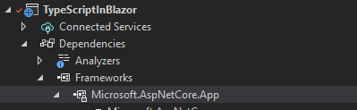

# Table of Contents

- [Table of Contents](#table-of-contents)
  - [Introduction](#introduction)
  - [Prerequisites](#prerequisites)
    - [.NET 6.0](#net-60)
    - [Visual Studio 2022 Preview](#visual-studio-2022-preview)
    - [Mobile Development with .NET Workload](#mobile-development-with-net-workload)
  - [Demo](#demo)
    - [Create a Blazor Server Application](#create-a-blazor-server-application)
    - [Create TypeScript Code](#create-typescript-code)
    - [Integrate TypeScript in Blazor](#integrate-typescript-in-blazor)
  - [Conclusion](#conclusion)
  - [Complete Code](#complete-code)
  - [Resources](#resources)

## Introduction

In this episode, we are going to build a Blazor Server App using the `dotnet` CLI. We are going to enable TypeScript by adding a NuGet package reference to `Microsoft.TypeScript.MSBuild`. Then we are going to build a simple `logger` class in TypeScript. Lastly, we are going to leverage the `Microsoft.JSInterop` interface, and the `IJSRuntime` interface, to be able to call the `JavaScript` code generated from the TypeScript file from our C# code in the Blazor app.

We are also going to troubleshoot some common exceptions you may experience along the way.

At the end, you should end-up with a sample app that logs data in the browser's console.

End results will look like this:


Let's get to it.

## Prerequisites

The following prerequisites are needed for this demo.

### .NET 6.0

Download the latest version of the .NET 6.0 SDK [here](https://dotnet.microsoft.com/en-us/download).

>:blue_book: The demo below also applies to `ASP.NET Core` versions 3.0, 3.1, and 5.0, but we are using 6.0 for this demo.

### Visual Studio 2022 Preview

For this demo, we are going to use the latest version of [Visual Studio 2022 Preview](https://visualstudio.microsoft.com/vs/community/).

### Mobile Development with .NET Workload

In order to build Blazor apps, the ASP.NET and web development workload needs to be installed, so if you do not have that installed let's do that now.

  

## Demo

In the following demo we will create a Blazor application and I will show you how to use TypeScript in it. I followed some of the demos out there on the Internet, but some of them seem to be missing important steps. So, as we build this demo, I will deliberately make some common mistakes, so I can show you how to troubleshoot the process and interpret the errors.

>:blue_book: I will identify the mistakes with notes with the bomb (:bomb:) emoji.

### Create a Blazor Server Application

The first step, as usual, is to create our demo application. In this occasion, let's use the `dotnet` CLI to create our app, and then we will move to Visual Studio for code editing.

Make sure the .NET 6.0 SDK got installed correctly by typing `dotnet --info` in `Command Prompt` or `PowerShell`.

```dotnetcli
dotnet --info
.NET SDK (reflecting any global.json):
 Version:   6.0.300
 Commit:    8473146e7d

Runtime Environment:
 OS Name:     Windows
 OS Version:  10.0.22000
 OS Platform: Windows
 RID:         win10-x64
 Base Path:   C:\Program Files\dotnet\sdk\6.0.300\

Host (useful for support):
  Version: 7.0.0-preview.3.22175.4
  Commit:  162f83657c

.NET SDKs installed:
  3.1.419 [C:\Program Files\dotnet\sdk]
  5.0.400 [C:\Program Files\dotnet\sdk]
  5.0.406 [C:\Program Files\dotnet\sdk]
  5.0.408 [C:\Program Files\dotnet\sdk]
  6.0.100 [C:\Program Files\dotnet\sdk]
  6.0.105 [C:\Program Files\dotnet\sdk]
  6.0.201 [C:\Program Files\dotnet\sdk]
  6.0.202 [C:\Program Files\dotnet\sdk]
  6.0.203 [C:\Program Files\dotnet\sdk]
  6.0.300 [C:\Program Files\dotnet\sdk]
```

:point_up: The output above is truncated to make it shorter.

:blue_book: If you already had the `Command Prompt` open when you installed the .NET 6 SDK, the `dotnet` command is not going to be recognized, as `Command Prompt` caches environment variables on load. Restarting the `Command Prompt` will fix the issue.

Once we verified `dotnet` is installed correctly, let's use it to create a Blazor application by running `dotnet new`. Now, I do not know about you, but I never remember all the names of the different templates to create apps via the CLI, so let's start by listing all the templates running first `dotnet new --list`. This is the result:

```dotnetcli
dotnet new --list
These templates matched your input:

Template Name                Short Name           Language    Tags
---------------------------  -------------------  ----------  ---------------------------------------------------------
.NET MAUI App (Preview)      maui                 [C#]        MAUI/Android/iOS/macOS/Mac Catalyst/Windows/Tizen
.NET MAUI Blazor App (Pr...  maui-blazor          [C#]        MAUI/Android/iOS/macOS/Mac Catalyst/WinUI/Tizen/Blazor
.NET MAUI Class Library ...  mauilib              [C#]        MAUI/Android/iOS/macOS/Mac Catalyst/Windows/Tizen
.NET MAUI ContentPage (C...  maui-page-csharp     [C#]        MAUI/Android/iOS/macOS/Mac Catalyst/WinUI/Tizen/Xaml/Code
.NET MAUI ContentPage (X...  maui-page-xaml       [C#]        MAUI/Android/iOS/macOS/Mac Catalyst/WinUI/Tizen/Xaml/Code
.NET MAUI ContentView (C...  maui-view-csharp     [C#]        MAUI/Android/iOS/macOS/Mac Catalyst/WinUI/Tizen/Xaml/Code
.NET MAUI ContentView (X...  maui-view-xaml       [C#]        MAUI/Android/iOS/macOS/Mac Catalyst/WinUI/Tizen/Xaml/Code
.NET MAUI ResourceDictio...  maui-dict-xaml       [C#]        MAUI/Android/iOS/macOS/Mac Catalyst/WinUI/Xaml/Code
Android Activity template    android-activity     [C#]        Android/Mobile
Android Application (Pre...  android              [C#]        Android/Mobile
Android Class Library (P...  androidlib           [C#]        Android/Mobile
Android Java Library Bin...  android-bindinglib   [C#]        Android/Mobile
Android Layout template      android-layout       [C#]        Android/Mobile
ASP.NET Core Empty           web                  [C#],F#     Web/Empty
ASP.NET Core gRPC Service    grpc                 [C#]        Web/gRPC
ASP.NET Core Web API         webapi               [C#],F#     Web/WebAPI
ASP.NET Core Web App         webapp,razor         [C#]        Web/MVC/Razor Pages
ASP.NET Core Web App (Mo...  mvc                  [C#],F#     Web/MVC
ASP.NET Core with Angular    angular              [C#]        Web/MVC/SPA
ASP.NET Core with React.js   react                [C#]        Web/MVC/SPA
ASP.NET Core with React....  reactredux           [C#]        Web/MVC/SPA
Blazor Server App            blazorserver         [C#]        Web/Blazor
Blazor WebAssembly App       blazorwasm           [C#]        Web/Blazor/WebAssembly/PWA
Class Library                classlib             [C#],F#,VB  Common/Library
Console App                  console              [C#],F#,VB  Common/Console
dotnet gitignore file        gitignore                        Config
Dotnet local tool manife...  tool-manifest                    Config
EditorConfig file            editorconfig                     Config
global.json file             globaljson                       Config
iOS Application (Preview)    ios                  [C#]        iOS/Mobile
iOS Binding Library (Pre...  iosbinding           [C#]        iOS/Mobile
iOS Class Library (Preview)  ioslib               [C#]        iOS/Mobile
iOS Controller template ...  ios-controller       [C#]        iOS/Mobile
iOS Tabbed Application (...  ios-tabbed           [C#]        iOS/Mobile
MacCatalyst Application ...  maccatalyst          [C#]        macOS/Mac Catalyst
MacCatalyst Binding Libr...  maccatalystbinding   [C#]        macOS/Mac Catalyst
MSTest Test Project          mstest               [C#],F#,VB  Test/MSTest
MVC ViewImports              viewimports          [C#]        Web/ASP.NET
MVC ViewStart                viewstart            [C#]        Web/ASP.NET
NuGet Config                 nugetconfig                      Config
NUnit 3 Test Item            nunit-test           [C#],F#,VB  Test/NUnit
NUnit 3 Test Project         nunit                [C#],F#,VB  Test/NUnit
Protocol Buffer File         proto                            Web/gRPC
Razor Class Library          razorclasslib        [C#]        Web/Razor/Library/Razor Class Library
Razor Component              razorcomponent       [C#]        Web/ASP.NET
Razor Page                   page                 [C#]        Web/ASP.NET
Solution File                sln                              Solution
Web Config                   webconfig                        Config
Windows Forms App            winforms             [C#],VB     Common/WinForms
Windows Forms Class Library  winformslib          [C#],VB     Common/WinForms
Windows Forms Control Li...  winformscontrollib   [C#],VB     Common/WinForms
Worker Service               worker               [C#],F#     Common/Worker/Web
WPF Application              wpf                  [C#],VB     Common/WPF
WPF Class library            wpflib               [C#],VB     Common/WPF
WPF Custom Control Library   wpfcustomcontrollib  [C#],VB     Common/WPF
WPF User Control Library     wpfusercontrollib    [C#],VB     Common/WPF
xUnit Test Project           xunit                [C#],F#,VB  Test/xUnit
```

You can also go to the [.NET default templates for dotnet new](https://docs.microsoft.com/en-us/dotnet/core/tools/dotnet-new-sdk-templates) page for the official documentation.

From the list, we gathered that we can use the template's short name `blazorserver` for a Blazor Server App, or `blazorwasm` for a Blazor WebAssembly App, so let's use that to build a Blazor Server app, with the following command:

```dotnetcli
dotnet new blazorserver -o TypeScriptInBlazor --no-https -f net6.0
```

The output is

```dotnetcli
The template "Blazor Server App" was created successfully.
This template contains technologies from parties other than Microsoft, see https://aka.ms/aspnetcore/6.0-third-party-notices for details.

Processing post-creation actions...
Running 'dotnet restore' on Y:\TypeScriptInBlazor\TypeScriptInBlazor\TypeScriptInBlazor.csproj...
  Determining projects to restore...
  Restored Y:\TypeScriptInBlazor\TypeScriptInBlazor\TypeScriptInBlazor.csproj (in 58 ms).
Restore succeeded.
```

So, as indicated in the output, let's restore dependencies now, but "CD'ing" into the `TypeScriptInBlazor` directory and execute `dotnet restore`

```dotnetcli
 cd TypeScriptInBlazor
 dotnet restore
 Determining projects to restore...
  All projects are up-to-date for restore.
```

Now let's verify the app builds and run by executing `dotnet watch`, which not only builds and start the app, but also enables Hot Reload, to update the app whenever you make code changes.

```dotnetcli
dotnet watch
dotnet watch 🔥 Hot reload enabled. For a list of supported edits, see https://aka.ms/dotnet/hot-reload.
  💡 Press "Ctrl + R" to restart.
dotnet watch 🔧 Building...
  Determining projects to restore...
  All projects are up-to-date for restore.
  TypeScriptInBlazor -> Y:\TypeScriptInBlazor\TypeScriptInBlazor\bin\Debug\net6.0\TypeScriptInBlazor.dll
dotnet watch 🚀 Started
info: Microsoft.Hosting.Lifetime[14]
      Now listening on: http://localhost:5265
info: Microsoft.Hosting.Lifetime[0]
      Application started. Press Ctrl+C to shut down.
info: Microsoft.Hosting.Lifetime[0]
      Hosting environment: Development
info: Microsoft.Hosting.Lifetime[0]
      Content root path: Y:\TypeScriptInBlazor\TypeScriptInBlazor\
```

The application should open on your default browser after the command.

  

### Create TypeScript Code

In order to integrate TypeScript code into our Blazor application, first we need to be able to build TypeScript code. You do that by adding a `NuGet` package called `Microsoft.TypeScript.MSBuild`, by first typing `Control + c` to stop the running app, and using `dotnet add package` to install the package.

```dotnetcli
Control+C
Application is shutting down...
Shutdown requested. Press Ctrl+C again to force exit.

dotnet add package Microsoft.TypeScript.MSBuild
  Determining projects to restore...
  Writing C:\Users\carl\AppData\Local\Temp\tmpBFDE.tmp
info : Adding PackageReference for package 'Microsoft.TypeScript.MSBuild' into project 'Y:\TypeScriptInBlazor\TypeScriptInBlazor\TypeScriptInBlazor.csproj'.
info :   CACHE https://api.nuget.org/v3/registration5-gz-semver2/microsoft.typescript.msbuild/index.json
info : Restoring packages for Y:\TypeScriptInBlazor\TypeScriptInBlazor\TypeScriptInBlazor.csproj...
info :   GET https://api.nuget.org/v3-flatcontainer/microsoft.typescript.msbuild/index.json
info :   OK https://api.nuget.org/v3-flatcontainer/microsoft.typescript.msbuild/index.json 180ms
info :   GET https://api.nuget.org/v3-flatcontainer/microsoft.typescript.msbuild/4.6.4/microsoft.typescript.msbuild.4.6.4.nupkg
info :   OK https://api.nuget.org/v3-flatcontainer/microsoft.typescript.msbuild/4.6.4/microsoft.typescript.msbuild.4.6.4.nupkg 287ms
info : Installed Microsoft.TypeScript.MSBuild 4.6.4 from https://api.nuget.org/v3/index.json with content hash G6cBFIGapWt85/Zi17GL2PBboy/6Xt2vZNmZj0xHXuKHbqbULKKvClHyiIfzAFCN10QqgVt0e9fxwC/1A1CcAA==.
info : Package 'Microsoft.TypeScript.MSBuild' is compatible with all the specified frameworks in project 'Y:\TypeScriptInBlazor\TypeScriptInBlazor\TypeScriptInBlazor.csproj'.
info : PackageReference for package 'Microsoft.TypeScript.MSBuild' version '4.6.4' added to file 'Y:\TypeScriptInBlazor\TypeScriptInBlazor\TypeScriptInBlazor.csproj'.
info : Generating MSBuild file Y:\TypeScriptInBlazor\TypeScriptInBlazor\obj\TypeScriptInBlazor.csproj.nuget.g.props.
info : Generating MSBuild file Y:\TypeScriptInBlazor\TypeScriptInBlazor\obj\TypeScriptInBlazor.csproj.nuget.g.targets.
info : Writing assets file to disk. Path: Y:\TypeScriptInBlazor\TypeScriptInBlazor\obj\project.assets.json
log  : Restored Y:\TypeScriptInBlazor\TypeScriptInBlazor\TypeScriptInBlazor.csproj (in 2.03 sec).
```

Now, let's move to Visual Studio and open the application.

  

Add a new item to the project,


>:bomb: There is a mistake in this step, can you identify what is it?

In the Add New Item dialog, search for TypeScript, change the default file name to `helpers.ts` and add the file.

  

Let's create now a helper `Logger` class, with a single `log` method that takes a string parameter `text` to be logged into the console. In addition to that, we need to to create a method to return an instance of the `Logger` class, using `export`.

Add the following code to your `helpers.ts` file.

```typescript
namespace helpers {
    // Simple logger class that exposes a log method.
    class Logger {
        // Log text to the console.
        public log(text: string) {
            console.log(text);
        }
    }

    // Method to return an instance of the Logger class.
    export function getLogger(): Logger {
        return new Logger();
    }
}
```

Build the project and verify that along with `helpers.ts` the files `helpers.js`, and `helpers.js.map` will be generated.

  

What happened here, is the builder took the TypeScript file and transformed it to JavaScript and added a map file. You may want to open and inspect `helpers.js`, and `helpers.js.map` and see the results of the build process done by the `Microsoft.TypeScript.MSBuild` package.

`helpers.js`

```javascript
var helpers;
(function (helpers) {
    // Simple logger class that exposes a log method.
    var Logger = /** @class */ (function () {
        function Logger() {
        }
        // Log text to the console.
        Logger.prototype.log = function (text) {
            console.log(text);
        };
        return Logger;
    }());
    // Method to return an instance of the Logger class.
    function getLogger() {
        return new Logger();
    }
    helpers.getLogger = getLogger;
})(helpers || (helpers = {}));
//# sourceMappingURL=helpers.js.map
```

```javascript
{"version":3,"file":"helpers.js","sourceRoot":"","sources":["helpers.ts"],"names":[],"mappings":"AAAA,IAAU,OAAO,CAchB;AAdD,WAAU,OAAO;IACb,iDAAiD;IACjD;QAAA;QAMA,CAAC;QALG,2BAA2B;QACpB,oBAAG,GAAV,UAAW,IAAY;YACnB,KAAK,CAAC,MAAM,CAAC,CAAC;YACd,OAAO,CAAC,GAAG,CAAC,IAAI,CAAC,CAAC;QACtB,CAAC;QACL,aAAC;IAAD,CAAC,AAND,IAMC;IAED,oDAAoD;IACpD,SAAgB,SAAS;QACrB,OAAO,IAAI,MAAM,EAAE,CAAC;IACxB,CAAC;IAFe,iBAAS,YAExB,CAAA;AACL,CAAC,EAdS,OAAO,KAAP,OAAO,QAchB"}
```

>:pencil2: Try removing the reference to `Microsoft.TypeScript.MSBuild` and build the application. The application will still build, but no `helpers.js`, and `helpers.js.map` will be generated.

### Integrate TypeScript in Blazor

Now is time to integrate TypeScript into our Blazor application.

Let's open up `Index.razor` and inject the `IJSRuntime` with `@inject IJSRuntime JSRuntime`. `IJSRuntime` lives in the `Microsoft.JSInterop` assembly, which already comes with the .NET 6.0 reference added by the template when we first created the application.

>:blue_book: IJSRuntime is an interface that represents an instance of a JavaScript runtime, which we can use to dispatch calls to it.

You can find that out by expanding `Dependencies` and then `Frameworks` under `Microsoft.AspNetCore.App` in the Solution Explored, and then going towards the bottoms of the dlls.

  


>:blue_book: The `Microsoft.JSInterop` namespace contains all the infrastructure you need to be able to make method calls between .NET and JavaScript in Blazor applications.

Now that `IJSRuntime` is setup to be injected, let's use it to get a reference to our TypeScript's `helpers` class.

Add a `@code {}` block to the bottom of `Index.razor` and let's try getting our helper class using `JSRuntime.InvokeAsync` extension method by overriding the `OnInitializedAsync` method.

After that we are going to call `InvokeVoidAsync` from our object reference, and pass the name of our TypeScript class `log` as the first parameter. Since `log` takes a `text: string` parameter, we can pass any string by creating an array of objects and passing the data along.

If you look at the `InvokeVoidAsync`'s signature, you will see it takes an arrays of objects, so let's do that.

  

```csharp
@code {
    protected override async Task OnInitializedAsync()
    {
        // Get a reference of hour TypeScript helpers.getLogger class.
        var jsObject = await this.JSRuntime.InvokeAsync<IJSObjectReference>("helpers.getLogger");

        // Invoke the log method.
        await jsObject.InvokeVoidAsync("log", new object[1] { $"LOG {DateTime.Now} - OnInitializedAsync called." });
    }
}
```

The `Index.razor` file should look like this now:

```csharp
@page "/"
@inject IJSRuntime JSRuntime

<PageTitle>Index</PageTitle>

<h1>Hello, world!</h1>

Welcome to your new app.

<SurveyPrompt Title="How is Blazor working for you?" />

@code {
    protected override async Task OnInitializedAsync()
    {
        // Get a reference of hour TypeScript helpers.getLogger class.
        var jsObject = await this.JSRuntime.InvokeAsync<IJSObjectReference>("helpers.getLogger");

        // Invoke the log method.
        await jsObject.InvokeVoidAsync("log", new object[1] { $"LOG {DateTime.Now} - OnInitializedAsync called." });
    }
}
```

>:bomb: However there is another issue here. Let's run the application and see what it is.

Hit F5 to run the application and you will see this exception screen:

  

Luckily, the exception message is very clear, we cannot make JavaScript interop calls during the `OnInitializedAsync` event. Let's try moving our code to `OnAfterRenderAsync`.

Override `OnAfterRenderAsync` and move the code there.

```csharp
@code {
    protected override async Task OnAfterRenderAsync(bool firstRender)
    {
        // Get a reference of hour TypeScript helpers.getLogger class.
        var jsObject = await this.JSRuntime.InvokeAsync<IJSObjectReference>("helpers.getLogger");

        // Invoke the log method.
        await jsObject.InvokeVoidAsync("log", new object[1] { $"LOG {DateTime.Now} - OnAfterRenderAsync called." });
    }
}
```

Now, coming back to the first "mistake" did you figure it out? If you run the application now, you will get an unhandled exception.

Notice that, unlike the exception before, the application will run, but we are getting notified of the exception on the bottom bar.

  

This is because on the first exception, the issue happened at runtime, on the C# call when we called `InvokeAsync`, in this case, the exception happened on the JavaScript side, while trying to get the instance of our helper class. So, because the error happened on the JavaScript side, the application will still run, but it is not going to behave as expected.

Therefore, you can use the F12 Development Tools on your browser to see what's going on.

  

The exception: Error: Could not find 'helpers.getLogger' ('helpers' was undefined) happens because we added our `helpers.ts` to the root of the project, and we need to add it to the `wwwroot` folder. Let's create a `js` folder under `wwwroot` and move `helpers.ts` there.

And since `helpers.ts` gets transformed to `helpers.js` we need to add a script reference to use it. Let's open `Layout.cshtml` and add `<script src="~/js/helpers.js"></script>` to it.

The `Layout.cshtml` file should look like this:

```razor
@using Microsoft.AspNetCore.Components.Web
@namespace TypeScriptInBlazor.Pages
@addTagHelper *, Microsoft.AspNetCore.Mvc.TagHelpers

<!DOCTYPE html>
<html lang="en">
<head>
    <meta charset="utf-8" />
    <meta name="viewport" content="width=device-width, initial-scale=1.0" />
    <base href="~/" />
    <link rel="stylesheet" href="css/bootstrap/bootstrap.min.css" />
    <link href="css/site.css" rel="stylesheet" />
    <link href="TypeScriptInBlazor.styles.css" rel="stylesheet" />
    <component type="typeof(HeadOutlet)" render-mode="ServerPrerendered" />
</head>
<body>
    @RenderBody()

    <div id="blazor-error-ui">
        <environment include="Staging,Production">
            An error has occurred. This application may no longer respond until reloaded.
        </environment>
        <environment include="Development">
            An unhandled exception has occurred. See browser dev tools for details.
        </environment>
        <a href="" class="reload">Reload</a>
        <a class="dismiss">🗙</a>
    </div>

    <script src="_framework/blazor.server.js"></script>
    <script src="~/js/helpers.js"></script>
</body>
</html>
```

And that should be it. Let's run the application, and open the F12 Development Tools. Then click a few times around the different menu options (Home, Counter, Fetch data.) We only added the logger to the Home page, so every time you move to the Home page, you should see a logging entry.


With that, we have successfully used TypeScript in our Blazor application with the help of `IJSRuntime`, and that concludes our demo.

## Conclusion

As you can see, adding the ability to use TypeScript in a Blazor application, and be able to call `JavaScript` code from C# is a very simple process. We just first added a reference to the NuGet package `Microsoft.TypeScript.MSBuild`, then we injected `IJSRuntime` into one of our razor pages, and finally we got a reference to the object and invoked the `log` method using `JSInterop`.

For more information about TypeScript and JSRuntime, check the links in the resources section below.

## Complete Code

The complete code for this demo can be found in the link below.

- <https://github.com/payini/TypeScriptInBlazor>

## Resources

| Resource Title                        | Url                                                                                            |
| ------------------------------------- | ---------------------------------------------------------------------------------------------- |
| The .NET Show with Carl Franklin      | <https://www.youtube.com/playlist?list=PL8h4jt35t1wgW_PqzZ9USrHvvnk8JMQy_>                     |
| Download .NET                         | <https://dotnet.microsoft.com/en-us/download>                                                  |
| .NET default templates for dotnet new | https://docs.microsoft.com/en-us/dotnet/core/tools/dotnet-new-sdk-templates                    |
| Microsoft.JSInterop Namespace         | https://docs.microsoft.com/en-us/dotnet/api/microsoft.jsinterop?view=aspnetcore-6.0            |
| IJSRuntime Interface                  | https://docs.microsoft.com/en-us/dotnet/api/microsoft.jsinterop.ijsruntime?view=aspnetcore-6.0 |